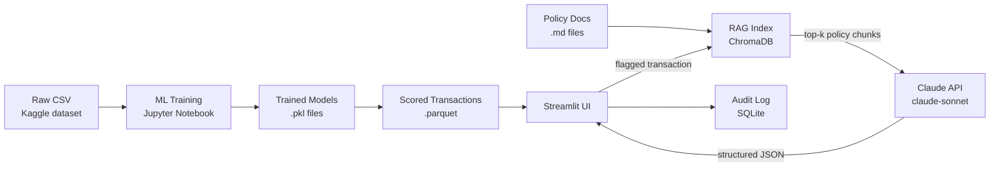
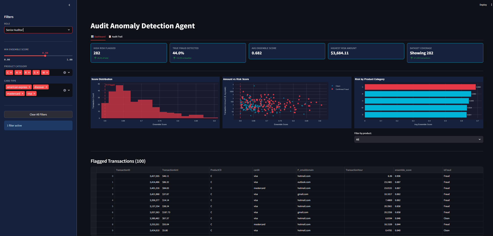
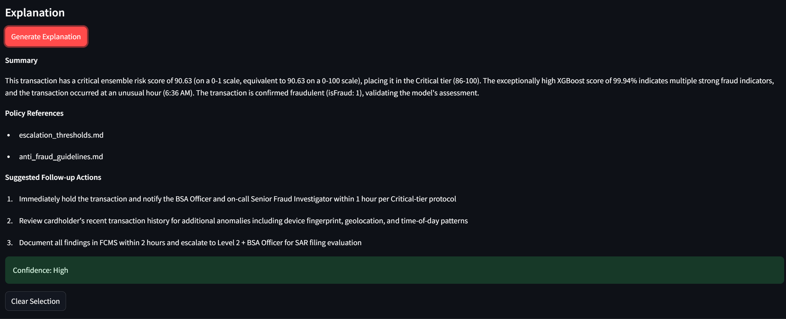
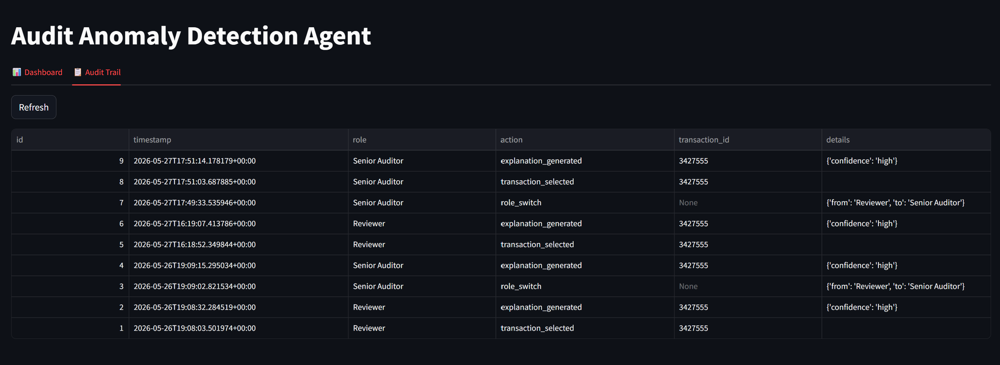

# Audit Anomaly Detection Agent

**Live demo:** [audit-anomaly-detection-agent-mvp.streamlit.app](https://audit-anomaly-detection-agent-mvp.streamlit.app/)

Financial institutions process millions of transactions daily. Traditional rule-based fraud systems are brittle — they catch known patterns but miss novel ones and flood analysts with false positives. Classical ML (isolation forest, XGBoost) can surface statistically unusual transactions, but it produces a score, not a story. This tool closes that gap: an ensemble model flags the anomalies, and a RAG-powered Claude agent reads the relevant internal policy documents and writes a plain-English explanation of *why* each transaction is suspicious and what the analyst should do next.

---

## What This Demonstrates

| Capability | Implementation |
|---|---|
| **Classical ML ensemble** | Isolation Forest + XGBoost + Logistic Regression; scores combined into a single `ensemble_score` |
| **RAG over policy documents** | ChromaDB vector store, sentence-transformers embeddings, top-k retrieval at query time |
| **LLM-powered explainability** | Claude (claude-sonnet) generates structured JSON: explanation, policy citations, follow-up actions, confidence |
| **Self-service Streamlit app** | Three-tab UI — anomaly review table, explanation panel, audit trail log |
| **Audit trail logging** | Every user action (role switch, transaction selected, explanation generated) written to SQLite |

---

## Architecture

---

## Screenshots

*Full dashboard with KPI cards and communicating charts*

*Claude-generated explanation with policy references and suggested actions*

*Audit trail logging all reviewer actions*

## Tech Stack

- **ML:** scikit-learn (IsolationForest, LogisticRegression), XGBoost, pandas, numpy
- **LLM:** Anthropic Python SDK, Claude claude-sonnet
- **RAG:** ChromaDB (persistent vector store), sentence-transformers (`all-MiniLM-L6-v2`)
- **App:** Streamlit
- **Storage:** parquet (scored transactions), SQLite (audit log)
- **Python:** 3.11+, pathlib, python-dotenv

## Limitations

- **Synthetic policy documents:** the three `.md` files in `policies/` are illustrative placeholders, not real compliance documents.
- **Mock RBAC:** the Reviewer / Senior Auditor role selector is UI-only; no authentication or permission enforcement backs it.
- **Public Kaggle dataset:** trained on the [IEEE-CIS Fraud Detection](https://www.kaggle.com/c/ieee-fraud-detection) dataset; performance on real production data is unknown.
- **No model versioning:** a single `.pkl` artifact per model; no experiment tracking or rollback.
- **No production monitoring:** score drift, data drift, and model staleness are not tracked.
- **Single LLM:** no fallback if the Claude API is unavailable or rate-limited.
---
