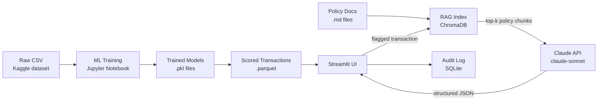

# Audit Anomaly Detection Agent

**Live demo:** [audit-anomaly-detection-agent-mvp.streamlit.app](https://audit-anomaly-detection-agent-mvp.streamlit.app/)

Financial institutions process millions of transactions daily. Traditional rule-based fraud systems are brittle — they catch known patterns but miss novel ones and flood analysts with false positives. Classical ML (isolation forest, XGBoost) can surface statistically unusual transactions, but it produces a score, not a story. This tool closes that gap: an ensemble model flags the anomalies, and a RAG-powered Claude agent reads the relevant internal policy documents and writes a plain-English explanation of *why* each transaction is suspicious and what the analyst should do next.

---

## What This Demonstrates

| Capability | Implementation |
|---|---|
| **Classical ML ensemble** | Isolation Forest + XGBoost + Logistic Regression; scores combined into a single `ensemble_score` |
| **RAG over policy documents** | ChromaDB vector store, sentence-transformers embeddings, top-k retrieval at query time |
| **LLM-powered explainability** | Claude (claude-sonnet) generates structured JSON: explanation, policy citations, follow-up actions, confidence |
| **Self-service Streamlit app** | Three-tab UI — anomaly review table, explanation panel, audit trail log |
| **Audit trail logging** | Every user action (role switch, transaction selected, explanation generated) written to SQLite |

---

## Architecture



---

## Tech Stack

- **ML:** scikit-learn (IsolationForest, LogisticRegression), XGBoost, pandas, numpy
- **LLM:** Anthropic Python SDK, Claude claude-sonnet
- **RAG:** ChromaDB (persistent vector store), sentence-transformers (`all-MiniLM-L6-v2`)
- **App:** Streamlit
- **Storage:** parquet (scored transactions), SQLite (audit log)
- **Python:** 3.11+, pathlib, python-dotenv

---

## How to Run Locally

**1. Clone and install dependencies**
```bash
git clone <repo-url>
cd audit-anomaly-detection-agent
pip install -r requirements.txt
```

**2. Set your Anthropic API key**
```bash
# Create a .env file at the repo root
echo ANTHROPIC_API_KEY=sk-ant-... > .env
```

**3. Build the RAG index** *(once; the app auto-rebuilds this on Streamlit Cloud cold starts)*
```bash
python -c "from src.rag_index import build_index; build_index()"
```

**4. Run the app**
```bash
streamlit run app.py
```

Open `http://localhost:8501`, or use the [live demo](https://audit-anomaly-detection-agent-mvp.streamlit.app/). Select a transaction in Tab 1, switch to Tab 2, and click **Generate Explanation**.

**Run smoke tests**
```bash
python -m pytest src/
```

---

## Deploy to Streamlit Community Cloud

**1. Push the repo to GitHub** (fork or push — `scored_transactions.parquet` and the `policies/` docs are committed and travel with the repo)

**2. Create a new app on [share.streamlit.io](https://share.streamlit.io)**
- Repository: your GitHub repo
- Branch: `main`
- Main file: `app.py`

**3. Add your API key under *Settings → Secrets***
```toml
ANTHROPIC_API_KEY = "sk-ant-..."
```

**4. Click Deploy.** On cold start the app automatically builds the ChromaDB index from the committed policy docs (`@st.cache_resource`), then loads the pre-scored parquet file. No manual setup required.

> **Note:** Streamlit Community Cloud has an ephemeral filesystem — the ChromaDB index and `audit_log.db` are rebuilt/recreated on every cold start. This is fine for a portfolio demo.

---

## Limitations

- **Synthetic policy documents** — the three `.md` files in `policies/` are illustrative placeholders, not real compliance documents.
- **Mock RBAC** — the Reviewer / Senior Auditor role selector is UI-only; no authentication or permission enforcement backs it.
- **Public Kaggle dataset** — trained on the [IEEE-CIS Fraud Detection](https://www.kaggle.com/c/ieee-fraud-detection) dataset; performance on real production data is unknown.
- **No model versioning** — a single `.pkl` artifact per model; no experiment tracking or rollback.
- **No production monitoring** — score drift, data drift, and model staleness are not tracked.
- **Single LLM** — no fallback if the Claude API is unavailable or rate-limited.

---

## What's Next (Production Checklist)

- Replace placeholder policies with real compliance and AML documentation
- Enforce RBAC via an identity provider (OAuth / SAML); log access at the API layer
- Add model versioning with MLflow or a model registry; track experiment lineage
- Instrument score drift with Evidently AI or Arize; set up alerting thresholds
- Multi-LLM fallback (e.g. Claude → GPT-4o) for resilience
- Containerise with Docker; deploy behind an internal reverse proxy with SSO

---

*Built with [Claude Code](https://claude.ai/code)*
